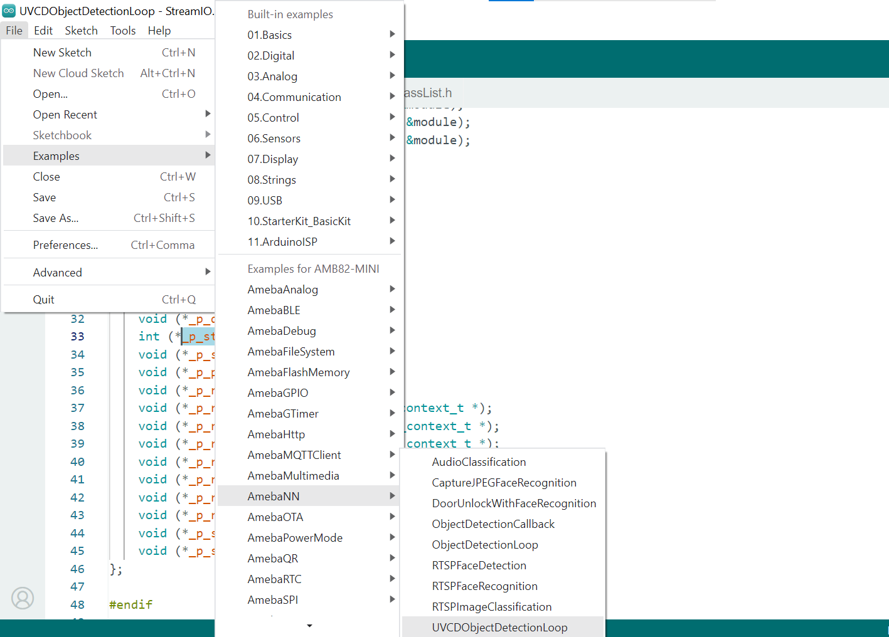
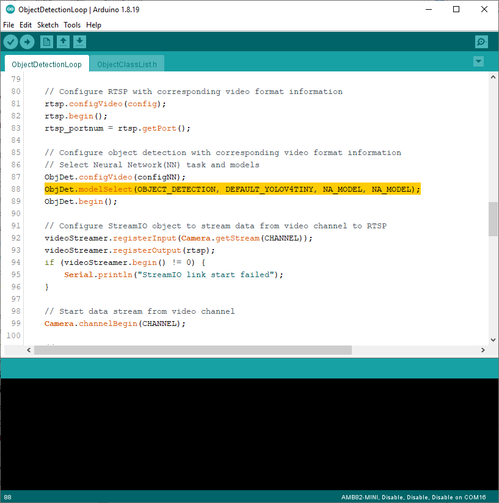
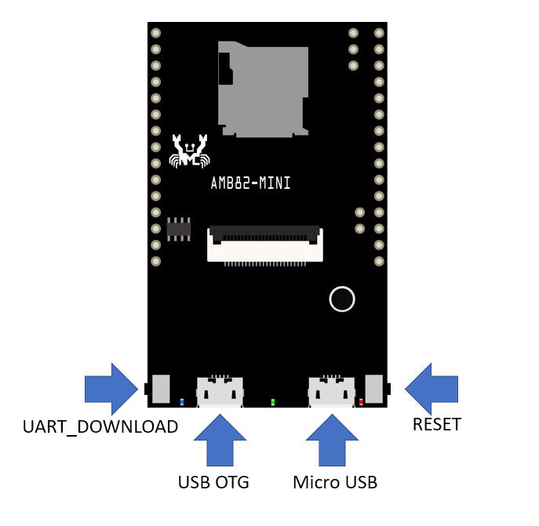
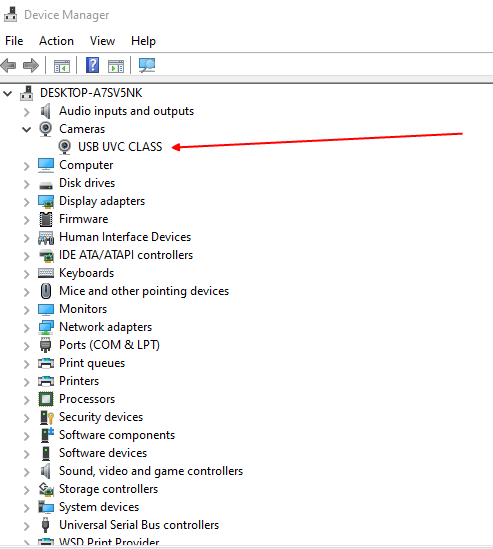
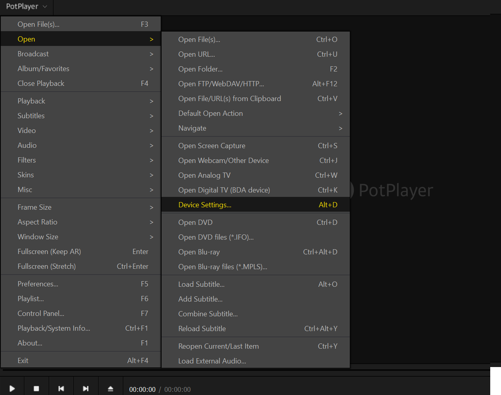
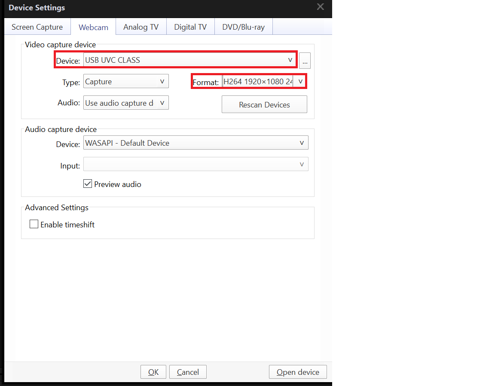

UVCD Object Detection
=====================

.. contents::
  :local:
  :depth: 2

Materials
---------

- `AMB82-mini <https://www.amebaiot.com/en/where-to-buy-link/#buy_amb82_mini>`_ x 1

Example 
-------

In this example, we will be using Ameba Pro2 development board to detect 80 different kinds of objects such as person, bicycle, car, laptop etc using on-board camera sensor (JX-F37P).

The following examples show how Object Detection and On-Screen Display is used.

Open the example, “File” -> “Examples” -> “AmebaNN” -> "UVCDObjectDetectionLoop".

|image01|

Select Neural Network (NN) task and models using modelSelect() function highlighted in yellow. This function takes 4 arguments: Neural Network task, Object Detection model, Face Detection model and Face Recognition model. Replace with “NA_MODEL” if they are not necessary for your selected Neural Network task. Note that it is mandatory to call modelSelect() function before calling the begin() function.

Valid Neural Network task: OBJECT_DETECTION, FACE_DETECTION, FACE_RECOGNITION

Valid Object Detection model:

YOLOv3 model: DEFAULT_YOLOV3TINY, CUSTOMIZED_YOLOV3TINY

YOLOv4 model: DEFAULT_YOLOV4TINY, CUSTOMIZED_YOLOV4TINY

YOLOv7 model: DEFAULT_YOLOV7TINY, CUSTOMIZED_YOLOV7TINY

Valid Face Detection model: DEFAULT_SCRFD, CUSTOMIZED_SCRFD

Valid Face Recognition model: DEFAULT_MOBILEFACENET, CUSTOMIZED_MOBILEFACENET

Choose the customized option (e.g., CUSTOMIZED_YOLOV4TINY/ CUSTOMIZED_SCRFD/ CUSTOMIZED_MOBILEFACENET) if you would like to use your own NN model. To learn about the process of converting an AI model, refer to https://www.amebaiot.com/en/amebapro2-ai-convert-model/ . Additionally, refer to https://www.amebaiot.com/en/amebapro2-apply-ai-model-docs/ to understand how to install and use the converted model.

Note that for Yolov7 object detection training from pytorch, you will need to perform an additional step for reparameterization. For this reparameterization step, Realtek has provided two scripts in the folder Yolov7_reparam_scripts, under ~/NeuralNetwork/Yolov7_reparam_scripts.

Command to run is:

python reparam_yolov7-tiny.py --weights weights/best.pt --custom_yaml custom/yolov7-tiny-deploy.yaml --output best_reparam.pt

|image02|

Compile the code and upload it to Ameba. After pressing the Reset button, connect the “USB OTG” via micro-USB cable to the target device such as PC.

|image03|

Review the USB cam driver as following picture.

|image04|

The result of detected objects can be validated using Potplayer. You may download Potplayer from the link `here <https://potplayer.org/en/potplayer-zip.html>`__.

Upon the completion of the software installation, open Potplayer, and go to “PotPlayer” -> “Open” -> "Device Settings".

|image05|

Next, on Device and Format drop down menu, select "USB UVC CLASS" and "H264 1920x1080 24" and click "Open device".

|image06|

The video stream from the camera will be shown in Potplayer.

A bounding box with its object name and confidence score will be drawn on the RTSP video stream to highlight the recognised objects.

|image07|

.. |image07| image:: ../../../_static/amebapro2/Example_Guides/Neural_Network/Neural_Network_-_UVCD_Object_Detection/image07.png
   :width:  772 px
   :height:  453 px
   