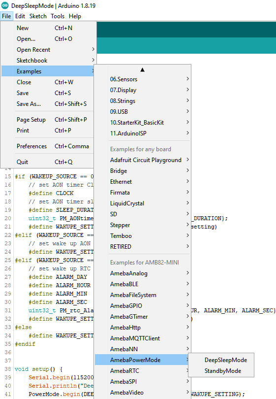
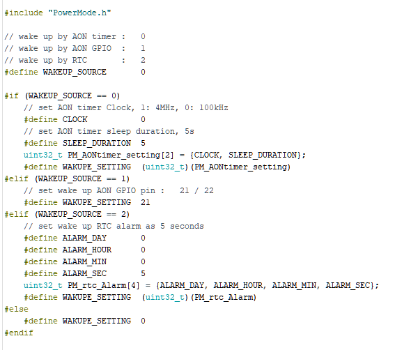
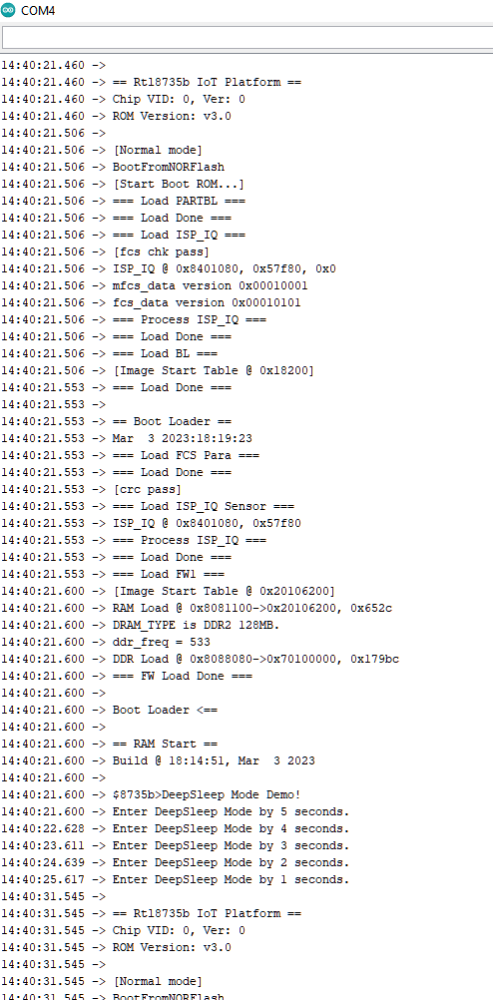

Deep Sleep Mode
===============

.. contents::
  :local:
  :depth: 2

Materials
---------

- `AMB82-mini <https://www.amebaiot.com/en/where-to-buy-link/#buy_amb82_mini>`_ x 1

-  Optional: Push button x 1

-  Optional: Register 220 ohms x 1

Example
-------

In this example, the development board will demo the non retention Deep Sleep Mode for power save. There are 3 wake-up sources for Deep Sleep Mode which are: AON Timer, AON GPIO, and RTC. The system will count down 5s then go to Deep Sleep mode. Upon the wake-up source being triggered, the system will be reboot and wake up again.

The module and board power consumption report under Deep Sleep mode are listed in these two tables below.

**RTL8735B module power consumption test results**

+------------+---------------------------------------------------------+
| **Wake-up  | **Module power consumption                              |
| source**   | (uA)**                                                  |
+============+=========================================================+
|            | Deep Sleep Mode (measure at 3V3)                        |
+------------+---------------------------------------------------------+
| AON timer  | 32.78                                                   |
+------------+---------------------------------------------------------+
| AON GPIO   | 40.98                                                   |
+------------+---------------------------------------------------------+
| RTC        | 41.08                                                   |
+------------+---------------------------------------------------------+

**AMB82 MINI board Power Consumption**

+------------+----------------------------+----------------------------+
| **Wake-up  | **Development board power  |                            |
| source**   | consumption Approximate    |                            |
|            | measurement                |                            |
|            | (mA)**                     |                            |
+============+============================+============================+
|            | Normal Mode                | Standby Mode               |
+------------+----------------------------+----------------------------+
| AON timer  | 53.01                      | 4.59                       |
+------------+----------------------------+----------------------------+
| AON GPIO   | 52.97                      | 4.74                       |
+------------+----------------------------+----------------------------+
| RTC        | 53.05                      | 4.65                       |
+------------+----------------------------+----------------------------+

Open example in “File” -> “Examples” -> “AmebaPowerMode” ->
“DeepSleepMode”.

|image01|

| Next is setting up the system and entering the power mode. Please refer to the following steps for entering Deep Sleep mode.
| Step 1. Ensure RETENTION is "#define RETENTION 0" in this example.
| Step 2. Set up the “WAKEUP_SOURCE”, AON timer: 0; AON GPIO: 1; RTC: 2.
| Step 3. Set up the wake-up source setting. There are 3 wake-up sources, each one has its own settings.
| For AON timer, at section ”#if (WAKEUP_SOURCE == 0)”, set value to “CLOCK” and “SLEEP_DURATION”. “CLOCK” can be 4MHz or 100kHz. “SLEEP_DURATION” unit is in seconds.
| For AON GPIO, at section “#elif (WAKEUP_SOURCE == 1)”, set value to “WAKUPE_SETTING”. “WAKUPE_SETTING” in this case is the Pin number, that can be 21 or 22. The GPIO pin is set to active high, please refer to the following connection.

|image02|

| For RTC, at section “#elif (WAKEUP_SOURCE == 2)”, set value to “ALARM_DAY”, “ALARM_HOUR”, “ALARM_MIN”, or “ALARM_SEC”. All alarm values set the duration of RTC wake-up. The range is “1day, 0h, 0m, 0s” to “365day, 23h, 59min, 59s”.
| Step 3. Start the Deep Sleep mode. There is only 1 optional setting for this step. When the wake-up source is set to RTC, use “PowerMode.start(1970, 1, 1, 0, 0, 0);” to replace “PowerMode.start();” for setting the start time. (Default is 1970.1.1 00:00:00).

|image03|

| To wake up, all timers will automatically wake up when the duration is finished, all GPIO pins must active high by pressing the push button.
| The correct boot, enter deep sleep, and reboot cycle will be same as following picture.

|image04|

.. |image02| image:: ../../../_static/amebapro2/Example_Guides/PowerMode/Deep_Sleep_Mode/image02.png
   :width:  621 px
   :height:  517 px

