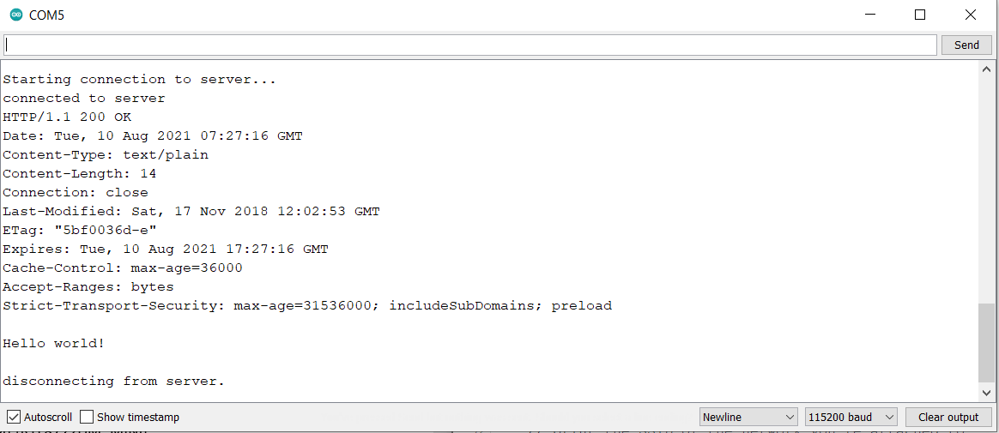

SSL Client for HTTPS Communication
==================================

.. contents::
  :local:
  :depth: 2

Materials
---------

-  `AMB82-mini <https://www.amebaiot.com/en/where-to-buy-link/#buy_amb82_mini>`_ x 1

Example
-------

This example uses Ameba to securely retrieve information from the
internet using SSL. SSL is an acronym for Secure Sockets Layer. It is a
cryptographic protocol designed to provide communications security over
a computer network, by encrypting the messages passed between server and
client.

Open the "WiFiSSLClient" example in "File" -> "Examples" -> "WiFi" -> "SSLClient".

|image01|

In the sample code, modify the highlighted snippet to reflect your WiFi
network settings.

|image02|

Upload the code and press the reset button on Ameba once the upload is
finished.

Open the serial monitor in the Arduino IDE and observe as Ameba
retrieves a text file from os.mbed.com.

|image03|

Code Reference
--------------

Use ``WiFiSSLClient client;`` to create a client that uses SSL. After creation, the client can be used in the same way as a regular client.

