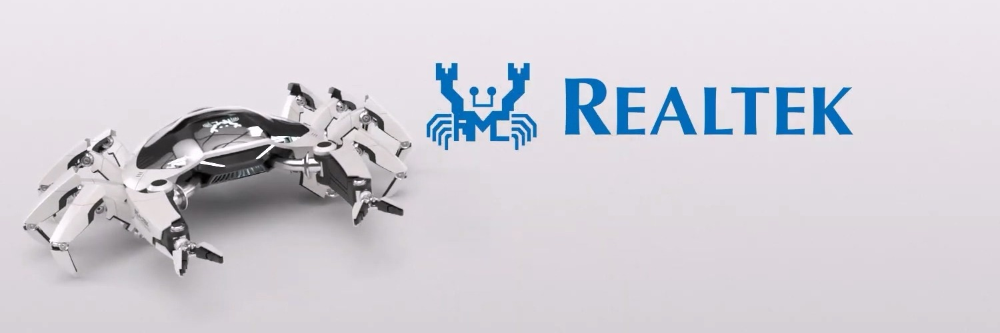
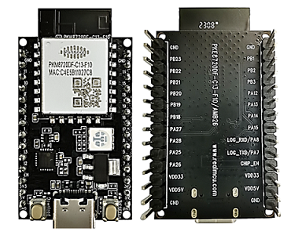

Welcome to Ameba AIoT Arduino Documentation!
============================================

|image01|

.. toctree::
   :hidden:
   :maxdepth: 1
   :caption: Ameba Pro2 EVBs:

   AMB82 mini <amebapro2/index>

.. toctree::
   :hidden:
   :maxdepth: 1
   :caption: Ameba D EVBs:

   AMB21 / AMB22 <amb21/index>
   AMB23 <amb23/index>
   AMB25 <amb25/index>
   AMB26 <amb26/index>
   BW16 <bw16-typeb/index>
   BW16-TypeC <bw16-typec/index>
   AW-CU488 <aw-cu488/index>

.. tabs::

   .. tab:: Ameba Pro2

      - `AMB82 mini <amebapro2/index.html>`_

      |image02|

   .. tab:: Ameba D

      - `AMB21 / AMB22 <amb21/index.html>`_

      |image03|

      - `AMB23 <amb23/index.html>`_

      |image04|

      - `AMB25 <amb25/index.html>`_

      |image05|

      - `AMB26 <amb26/index.html>`_

      |image06|

      - `BW16 <bw16-typeb/index.html>`_

      |image07|

      - `BW16-TypeC <bw16-typec/index.html>`_

      |image08|

      - `AW-CU488 <aw-cu488/index.html>`_

      |image09|

.. toctree::
   :maxdepth: 1
   :caption: Education:

   Ameba Education <Education/index>

.. toctree::
   :maxdepth: 1
   :caption: FAQ and Forum:

   Ameba IoT FAQ <FAQ/index>
   Ameba IoT Forum <https://forum.amebaiot.com/>
   Ameba IoT Forum FAQ <https://forum.amebaiot.com/c/faq/48>

.. toctree::
   :hidden:
   :maxdepth: 1
   :caption: Social Media:

   GitHub <https://github.com/Ameba-AIoT/>
   YouTube <https://www.youtube.com/@amebaiot7033>
   Facebook <https://www.facebook.com/groups/amebaioten>
   Facebook中文 <https://www.facebook.com/groups/AmebaIoT>
   BiliBili <https://space.bilibili.com/457777430>

.. toctree::
   :caption: All tags
   :hidden:
   :maxdepth: 1
   :titlesonly:

   _tags/tagsindex

.. |image02| image:: _static/ameba_board_photos/AMB82_MINI.png
   :target: amebapro2/index.html
   :width:  350px

.. |image03| image:: _static/ameba_board_photos/AMB21.png
   :target: amb21/index.html
   :width:  250px

.. |image04| image:: _static/ameba_board_photos/AMB23.png
   :target: amb23/index.html
   :width:  300px

.. |image07| image:: _static/ameba_board_photos/BW16_EVB_module.png
   :target: bw16-typeb/index.html
   :width:  150px

.. |image08| image:: _static/ameba_board_photos/BW16-typec.png
   :target: bw16-typec/index.html
   :width:  150px

